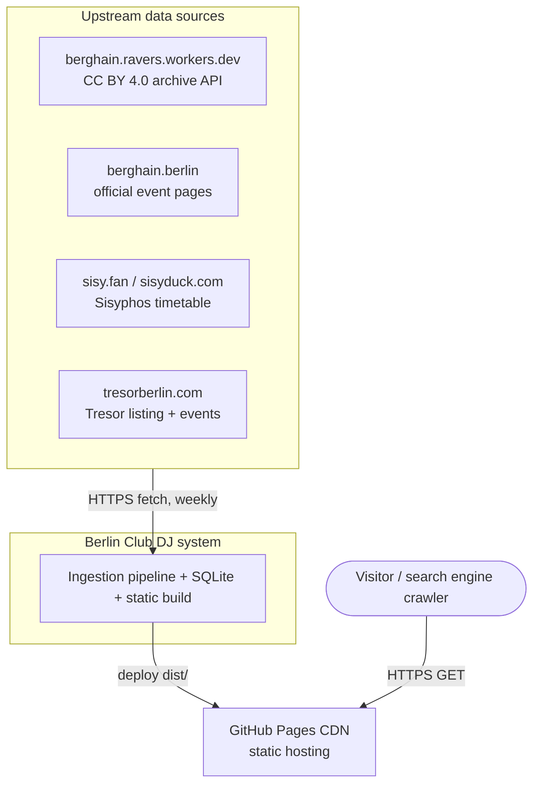
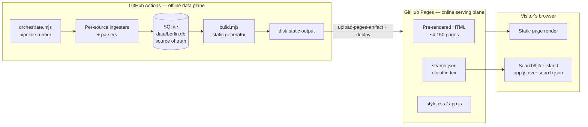
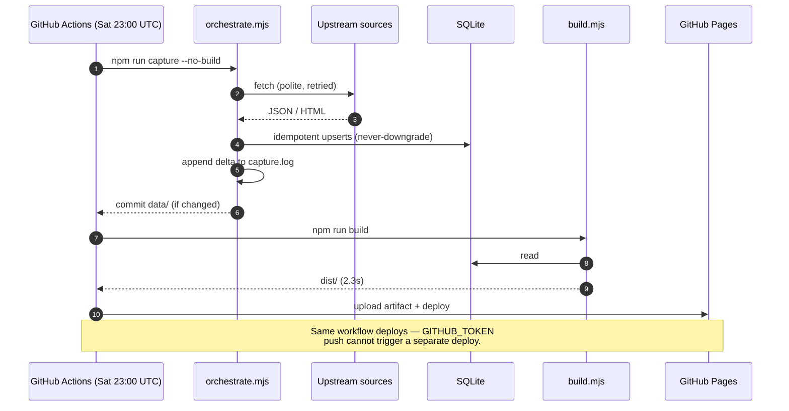
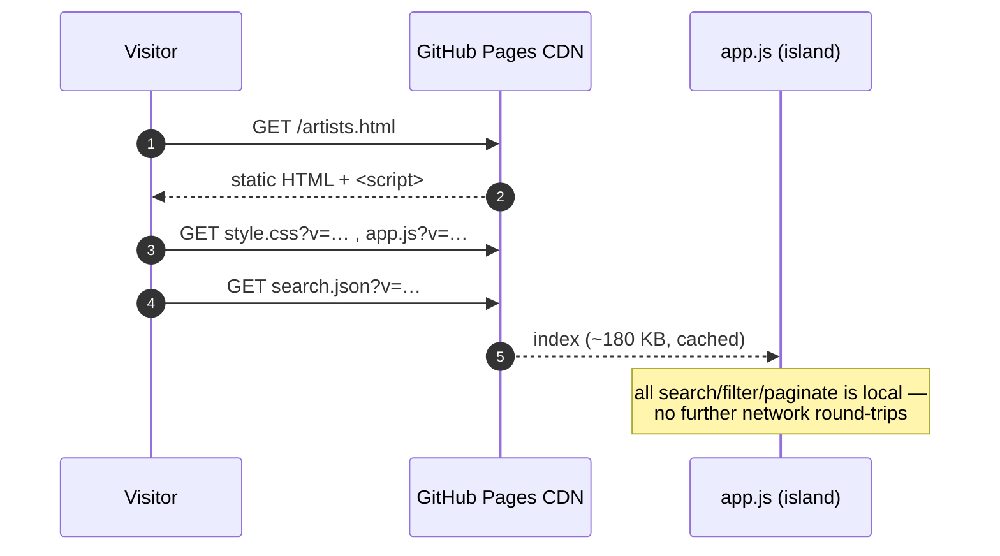
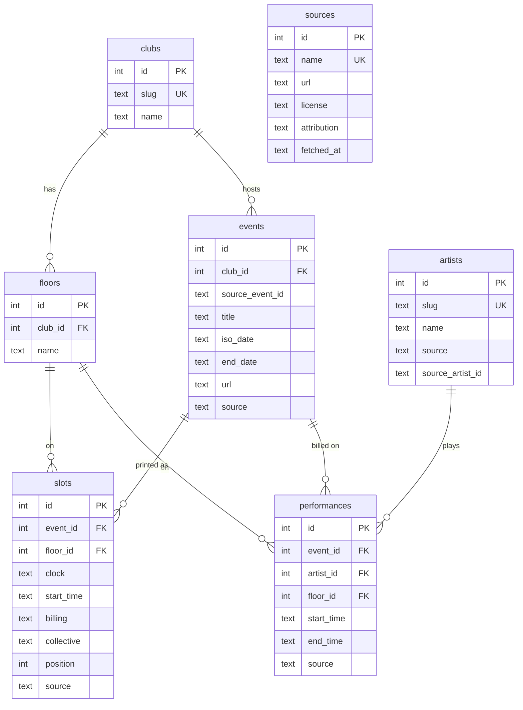
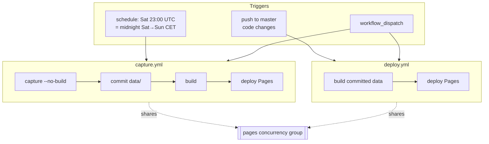

# Berlin Club DJ — System Design & Architecture

**Status:** Accepted / living document
**Last updated:** 2026-08-11
**Author:** Project maintainer (documented with staff-engineer review lens)
**Audience:** Any engineer picking up this system; a reviewer evaluating the design.

> **TL;DR.** A personal, queryable archive of *who played* at Berghain Klubnacht,
> Sisyphos, and Tresor — which DJ, which night, which floor, and (when published) at
> which hour. The **SQLite database is the source of truth**; the website is a
> **statically pre-rendered** read-only view over it, published to a CDN. A weekly
> **idempotent ingestion pipeline** refreshes data from third-party sources and
> redeploys. There is no server and no runtime database: every design choice follows
> from "read-only, infrequently-updated, SEO-relevant, single-maintainer, $0 budget."

This document is deliberately thorough. It is modelled on the conventions used in
Google's design-doc culture, the [arc42](https://arc42.org/overview) template, the
[C4 model](https://c4model.com/) for diagrams, Architecture Decision Records
([Nygard](https://github.com/joelparkerhenderson/architecture-decision-record)), the
[AWS Well-Architected Framework](https://docs.aws.amazon.com/wellarchitected/latest/framework/welcome.html)
pillars as a non-functional checklist, and the estimation discipline of the
[System Design Primer](https://github.com/donnemartin/system-design-primer). Real-world
exemplars that informed specific sections are cited inline and listed in
[§18](#18-references--prior-art).

---

## Table of contents

1. [Context & problem statement](#1-context--problem-statement)
2. [Goals and non-goals](#2-goals-and-non-goals)
3. [Requirements](#3-requirements)
4. [Constraints & assumptions](#4-constraints--assumptions)
5. [Scale & capacity estimation](#5-scale--capacity-estimation)
6. [High-level architecture](#6-high-level-architecture)
7. [Detailed component design](#7-detailed-component-design)
8. [Data model & storage](#8-data-model--storage)
9. [Interfaces & data contracts](#9-interfaces--data-contracts)
10. [Key trade-offs & decisions (ADRs)](#10-key-trade-offs--decisions-adrs)
11. [Failure modes & reliability](#11-failure-modes--reliability)
12. [Security, privacy & data rights](#12-security-privacy--data-rights)
13. [Observability & operations](#13-observability--operations)
14. [Deployment, rollout & data migration](#14-deployment-rollout--data-migration)
15. [Cost](#15-cost)
16. [Scalability & future evolution](#16-scalability--future-evolution)
17. [Risks & open questions](#17-risks--open-questions)
18. [References & prior art](#18-references--prior-art)
19. [Glossary](#19-glossary)

---

## 1. Context & problem statement

Berlin's techno institutions publish *who is playing* very differently, and none of them
offer a durable, queryable, cross-club history:

- **Berghain** (Klubnacht, since opening night 18 Dec 2004) publishes official lineups,
  and a community archive already reconstructs the full history — but its public API
  **strips set times**, and the data lives on someone else's infrastructure.
- **Sisyphos** deliberately does *not* announce lineups in advance; a human-maintained
  timetable appears late (Friday night → Saturday) and is **removed a few days after** the
  party. There is no archive to mine.
- **Tresor** publishes upcoming lineups (with set times close to the date) but **deletes
  past events** from its own site.

The problem: **capture this scattered, partly-ephemeral information into one durable
database and make it browsable** — by night, by DJ, by floor, by time — without standing
up (or paying for) server infrastructure, and without misrepresenting data that was never
published.

The guiding principle, repeated throughout: **the database is the artifact worth keeping;
the website is a disposable, regenerable view over it.**

## 2. Goals and non-goals

*(Following Google's design-doc emphasis on explicit non-goals to prevent scope creep.)*

### Goals

- **G1 — Durable archive.** A single SQLite file that captures who played, when, on which
  floor, at what time; survivable, versioned, and independent of any upstream going away.
- **G2 — Faithful provenance.** Every row is attributable to a source; nothing is invented;
  where a lineup or time was never published, it is left blank rather than guessed.
- **G3 — Browsable, fast, discoverable.** Nights, DJ profiles, per-stage timetables, search
  and filtering; fast to load; indexable by search engines.
- **G4 — Near-zero cost & ops.** Free hosting, no server to run/patch/scale, minimal
  maintenance.
- **G5 — Longevity.** Should still build and run years from now with minimal churn.
- **G6 — Capture-forward.** For sources with no history, accrue an archive going forward
  that nobody else has.

### Non-goals

- **NG1 — Real-time "who's playing now."** Upstream fan sites already do live timetables.
- **NG2 — Tracklists / what music was played.** MixesDB covers that; out of scope.
- **NG3 — User accounts, submissions, comments, or any user-generated content.** Read-only.
- **NG4 — Ticketing or commerce.**
- **NG5 — Comprehensive Sisyphos/Tresor *history*.** Impossible — the data was never
  retained upstream. Coverage will be sparse by nature, not by defect.
- **NG6 — Defeating bot protection or violating source terms.** Ruled out on principle;
  it also bounds which sources are usable (e.g. Resident Advisor is off-limits).
- **NG7 — A general-purpose CMS or framework.** Purpose-built, minimal.

## 3. Requirements

### 3.1 Functional requirements

| # | Requirement |
|---|-------------|
| F1 | **Nights index**, filterable by club (Berghain / Sisyphos / Tresor); nights with no published lineup are hidden. |
| F2 | **Event page** — a per-stage timetable (floor → time-ordered slots), with the DJ billing and set time; weekday shown for multi-day parties. |
| F3 | **DJ directory** — search 3,000+ artists by name; filter by club and by year range; each row's set count and active years re-aggregate to the active filter; paginated to browse all. |
| F4 | **DJ page** — every set that DJ ever played (date, club, floor, time), unfiltered, grouped by year. |
| F5 | **Stats** — most-booked ranking, sets-per-year. |
| F6 | **B2B / joint sets** link to *each* participating artist. |
| F7 | **Provenance surfaced** — source list in the footer and (formerly) a sources page. |

### 3.2 Non-functional requirements (AWS Well-Architected lens)

| Pillar | Requirement / target |
|---|---|
| **Performance efficiency** | Static HTML from a CDN; first paint fast; client search over a ~180 KB index returns instantly (no network per keystroke). |
| **Reliability** | Ingestion is **idempotent** and **never downgrades** a richer capture; one failing source must not abort others; a failed run is safe to re-run. |
| **Operational excellence** | Fully automated weekly refresh + deploy; every run logs a machine-readable delta; one-command local dev. |
| **Security** | No server, no database at runtime, no PII, no auth surface, no secrets beyond the CI token. |
| **Cost optimization** | $0 recurring. Must fit free tiers (GitHub Pages/Actions). |
| **Sustainability / maintainability** | Zero runtime dependencies; ~2.4 k LOC total; buildable years from now. |
| *(added)* **Discoverability (SEO)** | Pre-rendered pages, sitemap, meta/OG tags (see [§16](#16-scalability--future-evolution)). |

## 4. Constraints & assumptions

**Constraints**

- **C1 — Static hosting only.** GitHub Pages serves files, not code. No server-side
  execution, no runtime DB. Soft limits: **100 GB bandwidth/month**, **1 GB** published
  site size, ~10 builds/hour, 429 on abusive request rates.
- **C2 — CI environment.** GitHub Actions (Ubuntu runners), free tier for public repos.
  The default `GITHUB_TOKEN` **cannot trigger other workflows** (anti-loop rule) — a
  material constraint that shaped the deploy design (see [§11](#11-failure-modes--reliability)/[ADR-10](#adr-10--capture-workflow-self-deploys)).
- **C3 — Runtime: Node ≥ 22**, for built-in `node:sqlite` and `fetch` (enables the
  zero-dependency posture).
- **C4 — Third-party, heterogeneous sources**, each with its own shape, reliability, and
  licensing; some ephemeral; some anti-bot-protected (excluded).

**Assumptions**

- **A1 — Weekly freshness is sufficient.** No requirement for sub-day latency.
- **A2 — Single maintainer, low write concurrency.** No multi-writer coordination needed.
- **A3 — Dataset stays "moderate."** Thousands–tens-of-thousands of rows, thousands of
  pages — not millions (see [§5](#5-scale--capacity-estimation), [§16](#16-scalability--future-evolution)).
- **A4 — Sources' public HTML/JSON shapes are stable enough** to parse, and will change
  occasionally (parsers are treated as maintainable, not permanent — see [§11](#11-failure-modes--reliability)).

## 5. Scale & capacity estimation

*Back-of-envelope, per the System Design Primer discipline — the numbers justify the
"static is correct" conclusion.*

### Current data (measured)

| Table | Rows |
|---|---|
| clubs | 3 |
| artists | 3,021 |
| floors | 26 |
| events | 1,166 |
| performances (artist × event × floor) | 15,189 |
| slots (printed timetable lines) | 11,051 |
| sources | 3 |

Per club: **Berghain** 1,052 events / 10,813 slots · **Sisyphos** 90 events / 100 slots ·
**Tresor** 24 events / 138 slots.

### Artifacts (measured)

| Artifact | Size |
|---|---|
| `data/berlin.db` (source of truth) | 3.4 MB |
| `dist/search.json` (client index) | 180 KB |
| `dist/` (full published site) | 23 MB |
| Pre-rendered pages | 2,976 artist + 1,165 event + ~4 top-level ≈ **4,150 pages** |
| Cold full build | **2.3 s** |
| Incremental capture (all sources) | **~53 s** |
| Full Berghain set-time re-crawl (`--full`, rare) | **~9 min** |

### Growth

- Berghain: ~52 Klubnächte/year → **+~52 events, ~700 slots/yr**.
- Sisyphos + Tresor: ~1 event each per weekend → **+~100 events/yr** combined, captured
  forward.
- Artists: long tail; a few hundred new names/year.

**Time to 10×** (≈150 k performances, ≈40 k pages): **~15–20 years** at current cadence.
Build time scales roughly linearly with page count; even at 10× the cold build is minutes,
not hours, and the site stays well under the 1 GB Pages limit. The **1 GB published-size
limit** is the first hard ceiling we'd hit — see [§16](#16-scalability--future-evolution).

### Traffic

Niche audience. GitHub Pages' 100 GB/month soft cap ≈ **~2 million page views** at ~50 KB
each — orders of magnitude beyond expected demand, and the CDN absorbs spikes. Traffic is
**not** a design driver; if the site ever outgrew the free tier it would move hosts, not
architecture ([ADR-9](#adr-9--host-on-github-pages)).

**Conclusion:** read-only, ~10⁴ rows, ~10³–10⁴ pages, weekly writes, sub-3-second builds.
This is squarely in the domain where **static site generation is the textbook-correct
choice**, not a compromise.

## 6. High-level architecture

Two decoupled planes: an **offline data plane** (ingest → SQLite → build) that runs in CI,
and an **online serving plane** (CDN-served static files) that has no moving parts.

### 6.1 C4 Level 1 — System context

### 6.2 C4 Level 2 — Containers

Key property: **the two planes share only the git repository**. The data plane commits
`data/berlin.db` and publishes `dist/`; the serving plane is dumb file hosting. Nothing in
the serving plane can fail in a way the data plane must handle at request time, because
there is no request-time logic.

### 6.3 Solution strategy (arc42 §4)

1. **SQLite as a portable, single-file source of truth** — versioned in git.
2. **Adapter-per-source ingestion** — each source isolated behind its own parser +
   ingester; a bad source is one `DELETE WHERE source = ?` away from removal.
3. **Static pre-render** to HTML + a small client **island** for interactive search.
4. **Automate** the whole refresh→build→deploy loop on a weekly schedule.

## 7. Detailed component design

### 7.1 Ingestion adapters (`scripts/ingest-*.mjs`, `scripts/parse-*.mjs`)

One adapter per source shape. Parsers are pure functions (HTML/JSON → structured records)
and unit-testable in isolation; ingesters handle fetch, resolve, and upsert.

| Adapter | Source | Shape | Notes |
|---|---|---|---|
| `ingest-berghain` | ravers.workers.dev | JSON API | Backbone: canonical artists + events, 2004→. Incremental (skips artists already current). |
| `ingest-berghain-times` + `parse-bh-event` | berghain.berlin event pages | HTML | Set-time enrichment; official pages retain timetables for *past* nights too. Incremental by date window. |
| `ingest-sisyphos` + `parse-sisyfan` | sisy.fan (list via sisyduck API) | HTML tables | Full 5-stage timetable; sisyduck's own event pages are an empty SPA, so lineup comes from sisy.fan. Capture-forward. |
| `ingest-tresor` + `parse-tresor` | tresorberlin.com | HTML (WP) | Listing (untimed) + event pages (timed ranges). Capture-forward; **never downgrades** a timed capture to untimed. |

Cross-cutting adapter concerns (all implemented):
- **Politeness**: per-request delays, timeouts, retries with exponential backoff, honest
  user-agent.
- **Idempotency**: every write is an upsert keyed on natural identity (see [§8](#8-data-model--storage)).
- **Provenance**: every row carries a `source`.
- **B2B splitting**: a billing like `"Snow b2b Soundstream"` becomes one printed `slot`
  but links to *each* artist — whole-match against the archive first (so duos like
  "Blasha & Allatt" stay intact), split only when there's no whole match.
- **Fabrication guard** (Sisyphos): reject a batch if distinct events yield identical
  artist sets (a sign of parsing page chrome instead of a lineup).

### 7.2 Orchestrator (`scripts/orchestrate.mjs`)

The pipeline runner. Runs the four adapters in order, snapshots per-source counts
before/after, appends a machine-readable record to `data/capture.log`, and **never lets one
source's failure abort the others**. `--full` forces a complete Berghain set-time re-crawl;
the default is incremental (~53 s vs ~9 min). This is the "operational excellence" surface.

### 7.3 Static site generator (`scripts/build.mjs`, 506 LOC)

Reads SQLite → writes `dist/`. Pure string templating, no framework. Emits:
- one page per artist (with a set), one per event, plus index/DJs/stats,
- `search.json` (the client index),
- copies static assets, stamped with a **cache-busting build token** ([ADR-11](#adr-11--cache-busting-via-build-token)).

Rendering choices baked in: event pages prefer the rich `slots` timetable, falling back to
the flat `performances` lineup; nights with neither are hidden; weekday shown for multi-day
parties.

### 7.4 Client island (`assets/app.js`, 224 LOC)

The only interactive code. Loads `search.json` once, then does **client-side** search +
club/year filtering + **per-filter re-aggregation** (each DJ's shown set-count/year-range
is recomputed from a compact `(club, year, count)` breakdown) + pagination. Filters are
reflected in the URL (shareable). This is **islands architecture**: a static shell with one
hydrated interactive region — the modern best-practice pattern for "mostly static, a bit
interactive."

### 7.5 Runtime view — the two key scenarios

## 8. Data model & storage

**Store:** SQLite via Node's built-in `node:sqlite`, WAL mode, `busy_timeout` for
concurrent ingester/orchestrator processes. The `.db` file is committed to git — it *is*
the durable artifact and its own version history.

### 8.1 Entity–relationship

### 8.2 Two grains, on purpose

- **`performances`** is the *artist-centric* grain: one row = one artist on one floor at one
  event. Powers DJ pages, search, stats, aggregation.
- **`slots`** is the *event-centric* grain: one row = one printed timetable line, keeping
  the billing verbatim (`"Fiedel B2B DJ Pete"`) plus clock/label/position. Powers the
  per-stage event timetable. A B2B is **one** slot but **many** performances.

This dual grain is the key modelling decision: it lets us render the timetable exactly as
printed *and* attribute every DJ individually, without one view distorting the other.

### 8.3 Integrity, idempotency & identity

- **Natural-key uniqueness** drives upserts: `UNIQUE(club, source_event_id)` on events,
  `UNIQUE(event, artist, floor)` on performances, `UNIQUE(event, floor, clock, billing)` on
  slots. Re-running any ingester is always safe.
- **Provenance column** on every content table → mixed-source data stays auditable; a bad
  source is deleted with one statement.
- **Artist identity** via a normalized, Unicode-aware `slug`; alias consolidation follows
  the upstream billing (we don't try to out-clever the source).
- **Dates** stored as `YYYY-MM-DD` text (sorts lexically); set times as UTC ISO instants,
  rendered in `Europe/Berlin`.

### 8.4 Why SQLite (not Postgres / flat JSON)

See [ADR-1](#adr-1--sqlite-as-the-single-source-of-truth). In short: one portable file,
zero servers, real SQL for the build's aggregations, trivially versioned, right-sized for
10⁴ rows.

## 9. Interfaces & data contracts

- **Inbound (source contracts).** Each source has an implicit contract captured entirely
  in its parser: the ravers JSON shape, the berghain.berlin event-page DOM, the sisy.fan
  table structure, the Tresor WP markup. These are **untrusted and versionless** — the
  parser is the adapter and the assertion of the contract; drift is a maintenance event
  ([§11](#11-failure-modes--reliability)).
- **Internal (build → client).** `search.json` is the one real API surface:
  `{ generated, clubs: [[slug,name]…], artists: [[name, slug, perf]] }` where
  `perf = [[clubIdx, year, count], …]`. Compact (indices not slugs; grouped counts) to keep
  it ~180 KB. Versioned implicitly by the cache-busting token.
- **Outbound.** None. No public API; the site is the product. (If one were ever added, it
  would be a pre-generated static JSON, not a live endpoint — preserving the no-server
  posture.)

## 10. Key trade-offs & decisions (ADRs)

*Nygard-format records. Each is immutable; superseded decisions would be marked, not
deleted.*

### ADR-1 — SQLite as the single source of truth
**Status:** Accepted. **Context:** Need durable, queryable, versionable storage with no
server. **Decision:** Use a single SQLite file, committed to git, via built-in
`node:sqlite`. **Consequences:** ➕ Portable, serverless, real SQL for build aggregations,
free version history, right-sized. ➖ Not multi-writer (fine — single maintainer); binary
diffs in git bloat history slightly; a schema change needs a (cheap) migration.

### ADR-2 — Static site generation (not SSR / SPA / backend)
**Status:** Accepted. **Context:** Read-only, same-for-everyone content, weekly updates,
SEO matters, $0 budget. **Decision:** Pre-render all pages to static HTML at build time;
serve from a CDN. **Consequences:** ➕ Fastest delivery, zero attack surface, zero ops,
free, ideal SEO, scales with traffic trivially. ➖ **Data changes require a rebuild+deploy**
(accepted, automated); no per-user/real-time content (a non-goal).

### ADR-3 — Zero-dependency custom generator (not Astro/Eleventy/Hugo)
**Status:** Accepted. **Context:** Longevity (G5) and minimal maintenance vs framework
conveniences. **Decision:** ~500-line hand-rolled generator; no npm dependencies.
**Consequences:** ➕ No supply chain, no framework upgrades, builds unchanged for years,
full control. ➖ We hand-build things a framework gives free (sitemap, image opt, plugins);
higher bespoke-code surface. *Revisit if the site grows a large component/UI surface.*

### ADR-4 — Adopt the CC BY Berghain archive (not rebuild from scratch)
**Status:** Accepted. **Context:** A complete, licensed Klubnacht archive already exists.
**Decision:** Ingest it under CC BY 4.0 with attribution; treat it as the Berghain backbone.
**Consequences:** ➕ Years of accurate history for free, legally. ➖ Dependent on its
availability (mitigated: we hold our own copy in git); must preserve attribution (a licence
condition, honoured in footer + `sources`).

### ADR-5 — Scrape official event pages for set times (not API-only)
**Status:** Accepted. **Context:** The archive API strips set times, but berghain.berlin
event pages keep them (even for past nights). **Decision:** Enrich from the official pages.
**Consequences:** ➕ Richer data than any API exposes (per-stage times, Garten/Säule,
labels). ➖ HTML parsing is brittle to redesign; polite crawl cost.

### ADR-6 — Capture-forward for ephemeral sources (not backfill)
**Status:** Accepted. **Context:** Sisyphos/Tresor purge history; no clean archive exists
(Wayback thin; RA bot-protected + ToS). **Decision:** Poll weekly and accrue history going
forward; do not attempt backfill of unavailable data. **Consequences:** ➕ Legitimate,
sustainable, yields data nobody else has (incl. set times RA lacks). ➖ Coverage starts
sparse and grows slowly; a missed capture window is lost permanently (mitigated by
scheduling within the live window).

### ADR-7 — Islands (client-side search) not server or full pre-render of every query
**Status:** Accepted. **Context:** Search/filter is interactive; there's no server.
**Decision:** Ship one compact index; do search/filter/paginate/aggregate in the browser.
**Consequences:** ➕ Instant, offline-capable, no round-trips; static shell stays
SEO-friendly. ➖ ~180 KB index download; grows with artist count (see [§16](#16-scalability--future-evolution)).

### ADR-8 — Idempotent, never-downgrade ingestion
**Status:** Accepted. **Context:** Sources partially degrade before rolling off; fetches are
flaky; runs must be safely repeatable. **Decision:** Upsert on natural keys; when replacing
a captured event, keep the **better** snapshot ranked by (timed slots, then total slots).
**Consequences:** ➕ Re-runnable, self-healing, no timed→untimed regressions. ➖ Slightly
more per-event logic; "better" is a heuristic, not a proof.

### ADR-9 — Host on GitHub Pages
**Status:** Accepted. **Context:** Need free static hosting + CI in one place.
**Decision:** GitHub Pages + Actions; repo public (Pages is free only for public repos).
**Consequences:** ➕ $0, integrated CI/CD, custom-domain capable, CDN-backed. ➖ 100 GB/mo &
1 GB-size soft limits; public repo exposes the scraped data (acceptable for a personal
archive — see [§12](#12-security-privacy--data-rights)). *Exit path: Cloudflare/Netlify if limits bind.*

### ADR-10 — Capture workflow self-deploys
**Status:** Accepted (supersedes "separate push-triggered deploy"). **Context:** A commit
pushed by CI with the default `GITHUB_TOKEN` **does not trigger other workflows**, so the
weekly capture updated data but the site never rebuilt. **Decision:** Do
capture→commit→build→deploy **within one workflow**; share a `pages` concurrency group with
the push-triggered deploy. **Consequences:** ➕ Scheduled runs actually publish; no
cross-workflow trigger dependency. ➖ Pages-deploy steps duplicated across two workflows.

### ADR-11 — Cache-busting via build token
**Status:** Accepted. **Context:** CDNs/browsers cache `style.css`/`app.js`/`search.json`;
without versioning, updated sites served stale assets (observed in the field). **Decision:**
Append a per-build `?v=<token>` to all mutable asset URLs. **Consequences:** ➕ Fresh assets
on every deploy, no manual cache purges. ➖ Assets re-downloaded each deploy (negligible).

## 11. Failure modes & reliability

*Failure-mode analysis in the spirit of Stripe's idempotency/retry and Netflix's resilience
writing — adapted to a pipeline-not-a-service.*

| Failure mode | Blast radius | Mitigation | Residual risk |
|---|---|---|---|
| **Source HTML/JSON shape changes** (parser breaks) | One source's new data | Adapters isolated; fabrication guard; a broken parser yields *no* rows, not *wrong* rows; existing data untouched | Silent under-capture until noticed → observability gap ([§13](#13-observability--operations)) |
| **Ephemeral lineup missed** (capture outside live window) | That weekend's Sisyphos/Tresor lineup, permanently | Schedule inside the live window (Sat→Sun); manual `workflow_dispatch` for a catch-up | A single missed/failed Saturday loses that party |
| **Flaky fetch / partial page** | One event | Retries w/ backoff; **never-downgrade** replace; idempotent re-run | Rare stale slot until next run |
| **`GITHUB_TOKEN` can't trigger deploy** | Site never updates despite fresh data | **Resolved** by self-deploying capture ([ADR-10](#adr-10--capture-workflow-self-deploys)) | — |
| **Stale CDN/browser cache** | Users see old UI/data | **Resolved** by cache-busting token ([ADR-11](#adr-11--cache-busting-via-build-token)) | — |
| **Concurrent Pages deploys** (capture + push) | Deploy conflict | Shared `pages` concurrency group serializes them | — |
| **DB write contention** (parallel ingesters) | Ingest error | WAL + `busy_timeout` | — |
| **DB corruption** | Source of truth | WAL checkpoint before commit; **git history is the backup** (every weekly commit is a restore point) | Recover by `git checkout` an older `.db` |
| **Upstream source disappears** | Future refreshes for that source | We already hold the full history in git; capture simply stops adding | Static archive persists |
| **Source rate-limits/blocks us** | One source | Politeness (delays, backoff, low volume, honest UA); we never circumvent blocks | Lose that source (by design, not by force) |

**Reliability posture:** the whole pipeline is **stateless and replayable** — its only state
is the committed SQLite file. There is no request-path availability concern because there is
no request path: the CDN serves immutable files. "Recovery" is `git revert` + redeploy.

## 12. Security, privacy & data rights

- **Attack surface ≈ 0.** No server, no runtime DB, no user input, no auth, no cookies, no
  PII. The classic web risks (injection, SSRF, broken auth) are structurally absent.
- **Secrets:** only the CI `GITHUB_TOKEN`, scoped to `contents: write` + `pages: write`.
  No third-party API keys (all sources are unauthenticated public endpoints).
- **Supply chain:** **zero runtime dependencies** → no transitive-package risk. CI uses
  pinned official Actions.
- **Threat model of note:** the site *publishes* data. Content is public and low-risk
  (factual event listings). The relevant "abuse" concern is **our** behaviour toward
  sources: we crawl politely, cache, and **never circumvent bot protection** — which is why
  Resident Advisor (403 + captcha, ToS-restricted) is excluded on principle.
- **Data rights / licensing** — the material governance concern:
  - **Berghain** data is **CC BY 4.0**: reuse (incl. commercial) is permitted **with
    attribution**, which is a hard requirement met in the footer and `sources` table.
    *Removing attribution would violate the licence.*
  - **Sisyphos & Tresor** data is scraped from sources that grant **no licence**. As a
    **personal, non-commercial archive** this is low-risk; **monetization would materially
    change that risk** (see [§17](#17-risks--open-questions) and the product discussion) and is deliberately avoided.
- **Privacy:** DJ names are public performance credits, not personal data in the sensitive
  sense; no visitor data is collected (no analytics by default).

## 13. Observability & operations

For a static site there is **no runtime telemetry to collect** — the interesting signals are
all in the **data plane**:

- **`data/capture.log`** — one JSON record per run: timestamp, mode, per-source slot deltas,
  new events/performances, failures. This is the primary SLI feed.
- **GitHub Actions run history** — success/failure of every scheduled capture + deploy; the
  audit trail of what ran when.
- **git history of `data/berlin.db`** — every weekly commit is an observable, revertible
  data checkpoint.
- **Build summary** — page counts, slot totals, nights-with-times, printed each build.

**Defined SLIs / targets** (informal but explicit, per the "define SLOs up front" lesson):

| SLI | Target |
|---|---|
| Data freshness (age of newest capture) | ≤ 7 days |
| Weekly capture success | ~100% (manual dispatch as fallback) |
| Deploy success after a data change | 100% (self-deploying) |
| Ephemeral capture coverage | best-effort; a missed weekend is visible as a gap |

**Known observability gap (open):** a *silent* parser failure (source shape changed →
zero rows) currently surfaces only as a flat delta in `capture.log`, not an alert. See
[§17](#17-risks--open-questions).

## 14. Deployment, rollout & data migration

### 14.1 CI/CD topology

- **`capture.yml`** (scheduled + manual): refresh all sources → commit → **build + deploy in
  the same run** ([ADR-10](#adr-10--capture-workflow-self-deploys)). This is the weekly path.
- **`deploy.yml`** (push + manual): rebuild committed data → deploy. This is the
  **code-change** path (CSS/template edits).
- Both share a **`pages` concurrency group** so they never publish simultaneously.

### 14.2 Rollout & rollback

- **Rollout** is atomic at the CDN: `deploy-pages` swaps the published artifact.
- **Rollback** = `git revert` the offending commit (code *or* data) and let the push-deploy
  republish; or re-run a deploy from an earlier ref. Because the `.db` is versioned, **data
  rollback is a first-class git operation**.

### 14.3 Schema/data migration

- Schema is `CREATE TABLE IF NOT EXISTS` + additive `ALTER` — new columns/tables apply on
  next open; no destructive migrations. This mirrors (in miniature) the safe additive
  posture of Stripe's "online migrations" — additive first, backfill, then rely on it.
- `slots` is fully **regenerable** from sources, so a slot-schema change can be rebuilt via
  a `--full` re-crawl rather than a risky in-place migration — the escape hatch for the
  hardest changes.

## 15. Cost

| Item | Cost |
|---|---|
| Hosting (GitHub Pages, public repo) | **$0** |
| CI (GitHub Actions, public repo) | **$0** (unlimited minutes for public repos; the weekly run is ~1–9 min) |
| Storage (repo + git history of a 3.4 MB binary) | negligible; within limits |
| Data sources | **$0** (public, unauthenticated) |
| Runtime/LLM | **$0** (no runtime services) |
| *Optional* custom domain | ~$10–15/yr |

**Cost drivers to watch:** git-history bloat from the weekly binary `.db` commit (mitigable
by occasional history squash if it ever matters), and the 100 GB/mo bandwidth soft cap
(irrelevant at expected traffic). The system is, by construction, **cost-optimal for its
scale** — the AWS Cost pillar reduces here to "stay on free tiers," which the architecture
guarantees.

## 16. Scalability & future evolution

**Where the first ceilings are, and the escape hatches:**

| Dimension | First limit | Escape hatch |
|---|---|---|
| Published site size | **1 GB** Pages cap (currently 23 MB → ~40× headroom) | Move to Cloudflare Pages/Netlify (higher caps); or stop pre-rendering the long tail and render some pages client-side |
| `search.json` size | Client download grows ~linearly with artists (180 KB @ 3 k) | Prefix-shard the index; or ship SQLite-wasm and query in-browser; or a tiny search service |
| Build time | Linear in pages (2.3 s @ 4 k) | Incremental builds (only changed entities); parallelize |
| Bandwidth | 100 GB/mo soft cap | Different host / real CDN |
| A new club | — | **It's an adapter, not a migration** — the schema is club-agnostic by design |
| Interactivity (e.g. corrections, "now playing") | Static can't write | A single serverless function / form backend for *just* that feature; rest stays static |

**Extensibility already designed-in:** the club-agnostic schema, per-source adapters, and
the source/provenance column mean adding a fourth venue, or swapping a source, touches one
adapter and zero core code. The `slots`/`performances` dual grain accommodates richer
timetables without reshaping the model.

**Planned near-term (SEO best-practice pack, not yet built):** `sitemap.xml`, `robots.txt`,
Open Graph/Twitter meta, `schema.org` `MusicEvent` structured data. Pure upside for
discoverability; fully compatible with the static approach.

## 17. Risks & open questions

*Named honestly — the section reviewers engage with most.*

- **R1 — Parser brittleness (highest-likelihood risk).** Source redesigns silently break a
  parser. *Mitigation:* isolation + fabrication guard means "no data," not "wrong data."
  *Open:* add a post-capture **assertion/alert** (e.g. "expected ≥N Berghain slots this
  month; got 0") to close the silent-failure gap in [§13](#13-observability--operations).
- **R2 — Ephemeral coverage gaps.** A missed Saturday is unrecoverable. *Open:* is one
  weekly capture enough, or add a Friday-night + Sunday belt-and-suspenders (cheap)?
- **R3 — Data-rights ceiling on monetization.** The scraped, unlicensed Sisyphos/Tresor data
  makes ad-supported use legally shaky. *Decision so far:* stay non-commercial; a donation
  link is the safe maximum.
- **R4 — Artist name disambiguation.** Common names ("Boris", "Function") could conflate two
  people; we follow upstream billing rather than resolving identity. *Open:* acceptable, or
  invest in disambiguation if social links (which need exact identity) are added?
- **R5 — Single-maintainer bus factor.** One person, one head full of context. *Mitigation:*
  this document + a clean, dependency-free codebase + the DB as a self-describing artifact.
- **R6 — Public-repo exposure of scraped data.** Required for free Pages; accepted for a
  personal archive; would need re-evaluation if scope changed.

## 18. References & prior art

**Templates & method** — this doc's structure draws from:
[Design Docs at Google](https://www.industrialempathy.com/posts/design-docs-at-google/) ·
[arc42](https://arc42.org/overview) · [C4 model](https://c4model.com/) ·
[ADRs (Nygard)](https://github.com/joelparkerhenderson/architecture-decision-record) ·
[AWS Well-Architected](https://docs.aws.amazon.com/wellarchitected/latest/framework/welcome.html) ·
[System Design Primer](https://github.com/donnemartin/system-design-primer).

**Real-world exemplars studied** (what we borrowed from each):

| Article | Borrowed lens |
|---|---|
| [Discord — How Discord Stores Trillions of Messages](https://discord.com/blog/how-discord-stores-trillions-of-messages) | Before/after trade-off narrative with metrics |
| [Uber — The Architecture of Schemaless](https://www.uber.com/blog/schemaless-part-two-architecture/) | Detailed data-model + component design |
| [Airbnb — Avoiding Double Payments](https://medium.com/airbnb-engineering/avoiding-double-payments-in-a-distributed-payments-system-2981f6b070bb) | Precise correctness/idempotency requirements |
| [Stripe — Idempotency](https://stripe.com/blog/idempotency) · [Rate limiters](https://stripe.com/blog/rate-limiters) · [Online migrations](https://stripe.com/blog/online-migrations) | Idempotent retries; overload protection; additive migration playbook ([§8](#8-data-model--storage), [§11](#11-failure-modes--reliability), [§14](#14-deployment-rollout--data-migration)) |
| [Dropbox — Magic Pocket](https://dropbox.tech/infrastructure/magic-pocket-infrastructure) | Explicit durability/availability targets + cost trade-offs |
| [Slack — Real-time Messaging](https://slack.engineering/real-time-messaging/) | Named-component high-level architecture with targets |
| [LinkedIn — The Log](https://engineering.linkedin.com/distributed-systems/log-what-every-software-engineer-should-know-about-real-time-datas-unifying) | Grounding a design in one core abstraction |
| [Netflix — Distributed Tracing (Edgar)](https://netflixtechblog.com/building-netflixs-distributed-tracing-infrastructure-bb856c319304) | Observability / SLI framing |
| [Spotify — Event Delivery: The Road to the Cloud](https://engineering.atspotify.com/2016/02/spotifys-event-delivery-the-road-to-the-cloud-part-i) | "Why we re-architected" evolution narrative |

**This project's own docs:** [`SPEC.md`](SPEC.md) (product/data spec) · [`README.md`](README.md)
(operations) · the ADRs above (embedded here rather than as separate files, given scale).

## 19. Glossary

- **Klubnacht** — Berghain's flagship weekend event (Sat night → Mon morning).
- **Floor / stage** — a room with its own lineup (Berghain, Panorama Bar, Säule, Garten;
  Sisyphos' Hammahalle, Wintergarten, Strand, Dampfer, Tunnel; Tresor, Globus, …).
- **Performance** — one artist on one floor at one event (the artist-centric grain).
- **Slot** — one printed timetable line: a time + a billing on a floor (the event-centric
  grain).
- **Billing** — the printed act, possibly multiple DJs (`"A b2b B"`, `"A & B"`).
- **B2B** — "back to back," two+ DJs sharing one slot.
- **Capture-forward** — accruing history by polling live sources over time, because no
  historical archive exists to backfill.
- **Island / islands architecture** — a mostly-static page with one hydrated interactive
  region (here: the DJ search/filter).
- **SSG** — static site generation: rendering all pages at build time.
- **Idempotent** — safe to run repeatedly with the same effect (all ingesters are).
- **Never-downgrade** — on re-capture, keep the richer snapshot (more timed slots) rather
  than overwriting with a poorer one.
